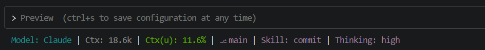
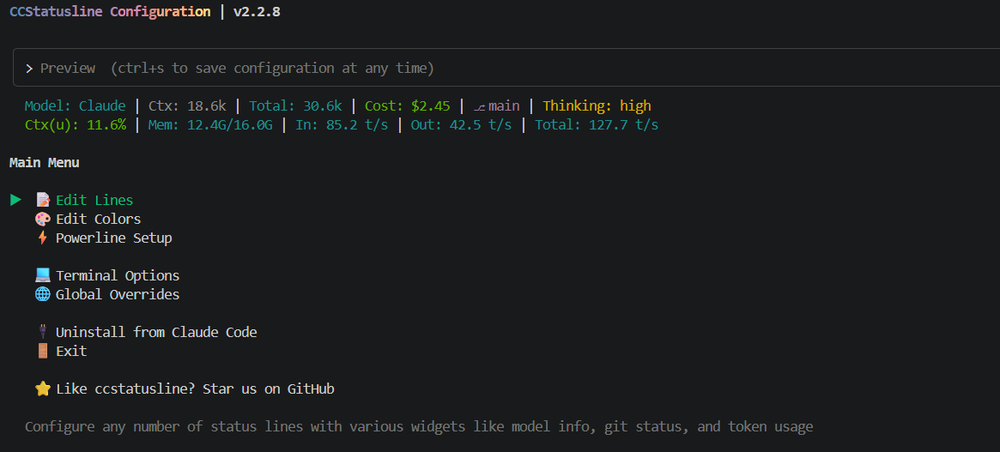
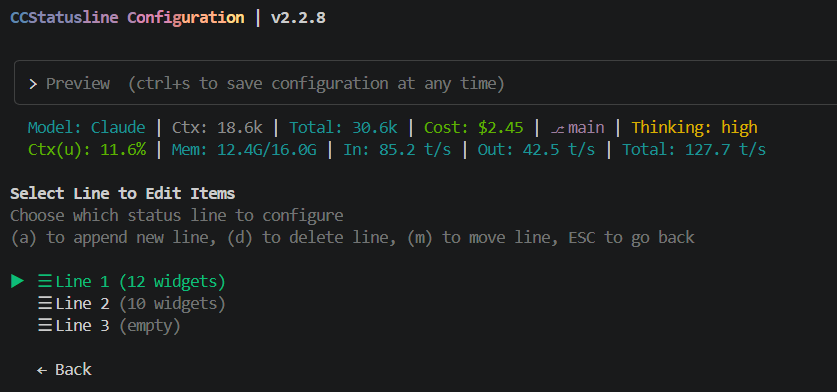
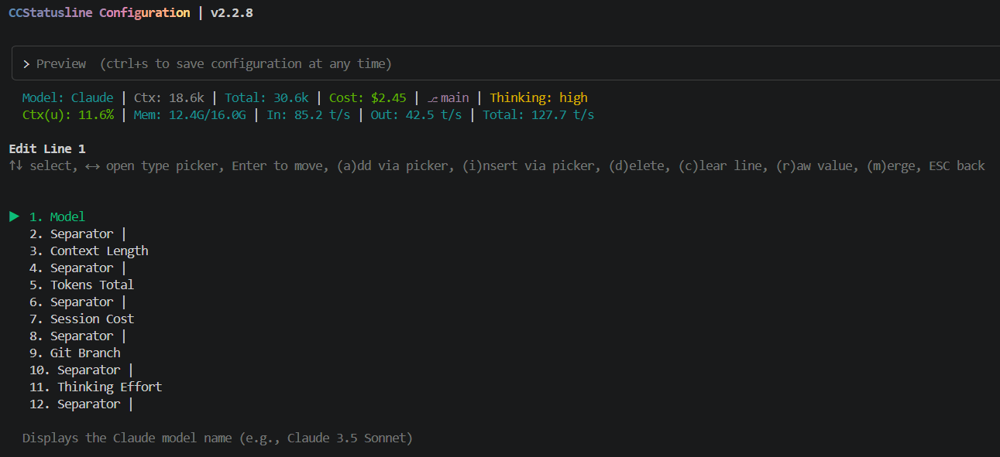
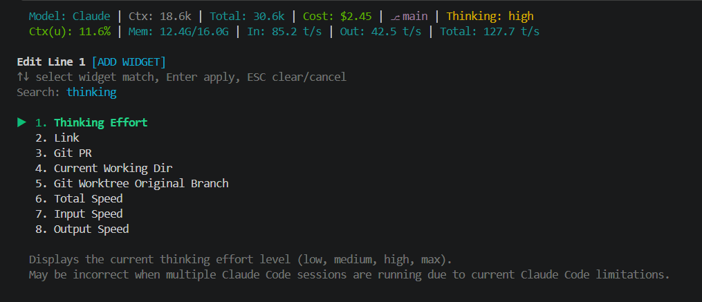
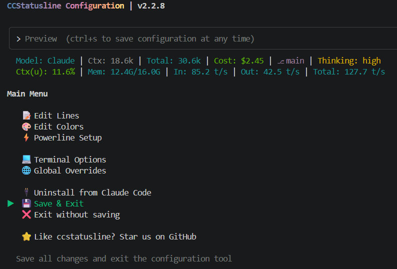
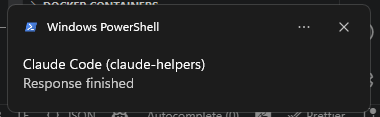
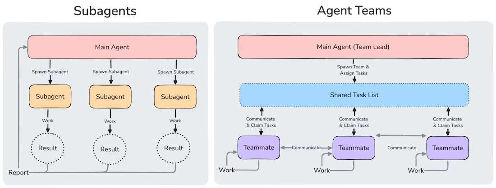
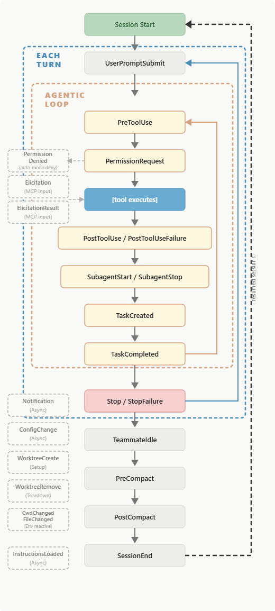
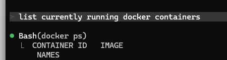

# Agentic Coding in Terminal

**Apex Builders Collective** × **Info PC • April** 2026

[Pre-Workshop Setup Guide](setup-guide)

> **Link to this site:** [https://tinyurl.com/abc-cc-workshop](https://tinyurl.com/abc-cc-workshop)

> 💁 **Workshop materials** — Use the navigation to browse all sections.

# Foundations

## What is Agentic Coding?

- Level 1 of AI coding, which was "let's take this code and paste into ChatGPT and ask for help".
- Level 2 could perhaps be autocomplete — your early GitHub Copilot, and Cursor.
- Level 3 is where we're at (though some might say we've gone way beyond this level by now) — the AI has the full context of your codebase, and can call *tools* to act as an agent to edit and write your code.

### Moving away from Vibe Coding, towards Agentic Coding and Spec-Driven Development

Vibe coding: toss a half-baked prompt at an AI, get something back, poke at it until it sort of works. It's fine for a hackathon or a one-off script. But the moment that you need code that other people will read, maintain, and deploy down the road for years to come, it stops working. You end up fighting the model's assumptions more than writing code yourself. 

Agentic coding with specs flips this: you handhold Claude Code like a junior engineer on your team. Write a spec, break it into tasks, set acceptance criteria, and let the agent execute against that structure.

Specs are the source of truth in an agent-led coding world. Clearly defined specs ensure that models have a framework to follow and reduce their hallucination rates and confidently-wrong analyses, leading to better output. All development must be spec-anchored and driven.

## Installation & Configuration

> For step-by-step installation instructions (API key setup, Claude Code, Codex, GSD), see the **[Pre-Workshop Setup Guide](setup-guide)**.

### Claude Products Overview

**What are the differences between Claude Models, Claude Harness, Claude Code, Claude API, Claude Max, Claude Desktop, Claude Design, Claude Code on the Web?**

- Claude Code is the terminal coding IDE used to call Claude models to perform various actions. Also known as an Agentic (Coding) Harness. Other alternatives to this are Codex (by OpenAI) and OpenCode. However, there is also a VSCode extension of Claude Code which is the UI alternative for those that are terminal-averse, however support is slower.
- Claude models are the different LLM models powering the different Anthropic products like Claude Desktop, Claude Code, Claude Design. As of Apr 2026, the main LLM models are Opus 4.6/4.7, Sonnet 4.6, Haiku 4.5
- Claude Max refers to one of the subscription tiers for usage-based consumer plans. The subscription plans are Pro($20 USD), Max 5X($100 USD) and Max 20X($200 USD). Refer to [https://claude.com/pricing](https://claude.com/pricing) for more details. The actual LLM usage derived from the subscription plans are way higher than the equivalent money cost through the Anthropic API
- Claude API aka Anthropic API refers to the API to call the different Claude LLMs. Billing of LLM calls when using the API is charged by per million token rates of the various models and is much more expensive when compared to using it through a subscription plan.
- Claude Desktop is the desktop app that allows you to chat, run Co-Work, run Claude Code but in a UI format. This requires a personal Claude account to access, and out of scope for this Claude Code workshop.
- Claude Code on the web allows for Claude Code sessions that run on Anthropic hardware online, allowing cloud Claude Code sessions that connect to your Github Repos online and do work and also submit PRs directly to the repo. These stay online and can be accessed from Claude Desktop or Claude website.

### Useful Claude Code Commands

Before we go deeper, here are some commands / CLI flags that are useful.

| Command | What it does |
| --- | --- |
| `/help` | Lists every command available in your setup — built-in, custom, plugin, and MCP-provided |
| `/init` | Scans the repo and generates a starter `CLAUDE.md`. NOT RECOMMENDED FOR USE |
| `/clear` | Wipes conversation history (CLAUDE.md stays loaded). Use when switching tasks or when you find that the context is filling up. This should be your most used command. Always start fresh whenever possible. |
| `/compact [focus]` | Summarizes history instead of wiping it. Pass instructions: `/compact keep the auth decisions`. NOT RECOMMENDED FOR USE |
| `/model [name]` | Switch model mid-session: `opus`, `sonnet`, `haiku`, `claude-opus-4-6[1m]` |
| `/cost` / `/stats` | Token spend (`/cost` for API users, `/stats` for Pro/Max) |
| `/resume` | Pick up a previous session. `claude -c` from the shell resumes the most recent. e.g `claude --resume <some-session-id>` |
| `Esc` | Stop Claude mid-action. |
| **`Ctrl+U` \|\| `Ctrl+Y`** | Cuts the current Input \|\| Paste the Cut prompt |
| `Ctrl+S` | Prompt Stashing - Best for mid-prompt and need to ask something else first. Stashed Prompt auto restores after sending something else. |
| `Esc Esc` (Empty prompt) | Open the rewind menu (selective: code only, conversation only, or both). You can also use `/rewind` |
| `@filepath` | Reference a file or directory inline — `@src/auth/login.ts fix the JWT check` |

**One-liner to remember:** type `/` on an empty prompt to see everything available in your setup, including custom and MCP commands. You'll rarely need to memorize a full list.

## Stop/Resume/Continue Claude Code conversations

| Action | Command | Remarks |
| --- | --- | --- |
| Stop a conversation | Ctrl + C twice in the session until the session is exited | All session history is stored as .jsonl files in .claude folder in User Directory. `~/.claude/projects/<folder name>` |
| Resume a previous conversation | `claude --resume`  which will show a list of previous conversations to resume from in this current folder, OR `claude —continue` which will auto continue from the last stopped conversation in this current folder | you can also append additional flags to these resume and continue commands for eg. `claude --continue --dangerously-skip-permissions --effort max --model claude-sonnet-4-6` |

### Useful Claude Code Customisation

1. cc-status line
    
    Leverage cc-status-line to customise metrics for better observability of your Claude Code session 
    GitHub *repo:* https://github.com/sirmalloc/ccstatusline
    
    ```bash
    npx -y ccstatusline@latest
    ```
    
    Install cc-status-line via npx
    
    Sample Config:
    
    Line 1:  Model | Context Length | Context % (usable) | Git Branch | Skills | Thinking Effort 
    
    
    
    - Installation step by step:
        1. Run `npx -y ccstatusline@latest` and select `Edit Lines` option (via pressing enter)
            
            
            
        2. Select which line to add 
            
            
            
        3. Decide where to put (tip: use Separator to cleanly separate widgets)
            
            
            
        4. Press (a) to add via picker and start typing to search (e.g thinking)
            
            
            
        5. Press `Esc` to return to Main Menu and select enter on `Install to Claude Code` or `Save & Exit` option
            
            
            
2. Windows Toast Notification 
    
    Native Windows toast notifications for Claude Code hook events. Shows which project triggered the notification so you can find the right VS Code window when running multiple sessions.
    
    See guide: https://github.com/stcomiin/claude-helpers
    
    Sample: 
    
    
    

## ✍️ But first, let's just make something (✍️Hands-on: 15 minutes)

Please open Claude Code, and ask it to give you a CRUD app of some kind. 

- CRUD: Create, Read, Update, Delete — your quintessential database app.
- Examples of CRUD apps you can build:
    - **Job applications tracker**: roles, companies, stages, and interview notes.
    - **Personal library tracker**: manage books, authors, reading status, and notes.
    - **Inventory manager**: products, stock counts, suppliers, and reorder levels.
    - **Student roster + attendance**: students, classes, attendance records, and remarks.
    - **Workshop registration system**: events, participants, tickets, and check-ins.
    - **Issue / bug tracker**: tickets, assignees, status, priority, and comments.
    - **Simple CRM**: leads, companies, contacts, and follow-up tasks.
    - **Recipe manager**: recipes, ingredients, tags, and meal plans.
    - **Expense tracker**: transactions, categories, budgets, and attachments.
    - **Appointment booking**: providers, timeslots, bookings, and cancellations.
    - **Asset checkout**: equipment, borrowers, due dates, and returns.
    - **Content calendar**: posts, channels, publish dates, and approvals.
    - **Donations + donors**: donors, campaigns, donation records, and receipts.
    - **Classroom resources**: worksheets, links, topics, and usage history.
    - **Support ticket inbox**: customers, conversations, labels, and resolutions.

---

# Working with Agentic Coding

## 🧠 Context & Memory

Agentic coding tools like Claude Code maintain context across a session, but understanding **where** memory lives — and how to shape it — is key to getting consistent, high-quality results.

### CLAUDE.md and AGENTS.md

- **`CLAUDE.md`** is a special file Claude Code reads automatically when it starts in a project. Use it to encode persistent instructions: coding conventions, architecture decisions, preferred libraries, things Claude should never do, and so on. The contents of this is injected at the start of the conversation, in one of the many system prompts.
- **`AGENTS.md`** serves a similar purpose for other agent runtimes (e.g. OpenAI Codex). If you're working across multiple agents, keeping both in sync is good practice using symlink.
- **Claude Code does NOT read AGENTS.md, only CLAUDE.md.** Do symlinks or @mention AGENTS.md inside CLAUDE.md
- Think of these files as your **onboarding doc for the AI** — the same way you'd brief a new contractor on how your codebase works, but not quite. Normally briefs would be done using actual documentation. CLAUDE.md is more for project specific stuff.
- Good things to put in `CLAUDE.md`:
    - Tech stack and versions
    - Folder structure conventions
    - Test framework and how to run tests
    - Linting / formatting rules
    - Anything the agent keeps getting wrong
- CLAUDE.md is not the magic pill. In long conversations, instructions tend to not be followed well. Compare the typical length of CLAUDE.md to your typical conversation length (few hundred tokens to 50k tokens)
- **Do not use /init to initialize the CLAUDE.md**. Automatically generated files are overly verbose and may harm model performance. Only add things specific to your codebase that the agent should be aware of. If something is general knowledge, assume the model knows it. Reinforce in CLAUDE.md only if the model does not remember or repeatedly does something wrong.
    - If you write one by hand, keep it tight: specific build commands, test runners, and hard constraints only. Skip codebase overviews (agents discover structure on their own just as well, or ask it to use codebase graph DB MCPs covered below)
    - **Paper that discusses auto-generated context files - Evaluating AGENTS.md: Are Repository-Level Context Files Helpful for Coding Agents?** [https://arxiv.org/abs/2602.11988](https://arxiv.org/abs/2602.11988)
- Example of actual CLAUDE.md

```markdown
## TOP RULES

- Always use MAXIMUM thinking effort
- Always use Opus for all agents and subagents
- Keep code minimum, viable simple but clean. YAGNI, DRY, KISS, do not overcomplicate modules with convoluted classes.
- Always run slash command `/simplify` at the end of every extensive refactor or new feature phase, before any commit
- Use chrome devtools mcp server to verify all UI related changes work as expected
- Always update ALL RELEVANT DOCUMENTATION MARKDOWNS in the repo when you have made a new change anywhere or after implementing new features or changing current features
- Do not commit anything until verification of work is done
- Always fix all existing issues even if they are not from your changes

## The #1 Rule of E2E Tests

- A test MUST fail when the feature it tests is broken. No exceptions. If a real user would see something broken, the test must fail. No "fixing the app inside the test". A passing test that hides a broken feature is worse than no test at all.
```

#### CLAUDE.md tiers: User, Project, Local

CLAUDE.md has three possible locations

| Scope | What it covers | Where it lives |
| --- | --- | --- |
| **User** | Preferences across all your projects (e.g. tone, formatting habits) | Global config (~/.claude/claude.md) |
| **Project** | Instructions specific to this repo (e.g. stack, conventions) | `CLAUDE.md` in repo root |
| **Local** | Overrides just for your machine (e.g. local paths, secrets) | `CLAUDE.local.md` |

Use **project memory** for anything the whole team should share. Project specific settings must be committed to the repo's CLAUDE.md

Use **local memory** for anything personal or environment-specific that shouldn't be committed.

Claude Code has some built-in skills to manage CLAUDE.md

1.  `/claude-md-management:revise-claude-md`  - Run this slash command in a specific session when you find something that should be updated for future sessions
2. `/claude-md-improver` - Use this slash command when wanting to add general stuff to the CLAUDE.md

#### ✍️ Hands-on: Craft Your CLAUDE.md (10 minutes)

Now that you understand how context and memory work, let's put it into practice. Open the CRUD app you built earlier and create a `CLAUDE.md` file in the project root.

Your `CLAUDE.md` should include:

- **Tech stack**: What framework, language, and database you're using
- **Folder structure**: Where routes, components, models, etc. live
- **Top rules**: At least 3 rules the agent must always follow (e.g. "always add Function Docstring to functions", "never use `any` types", "run tests before committing")

Test it out! Prompt Claude Code to add a feature. Check whether if follows the rules that you set. If it doesn't, tweak the file. 

> 😜 Example md file: "Always reply in Singlish!" 

### Compaction & Context Window Management

- LLMs have a finite context window. In long sessions, older conversation turns get summarised ("compacted") to free up context.
- What goes into the context? Visualize it - [https://code.claude.com/docs/en/context-window](https://code.claude.com/docs/en/context-window)
- [https://github.com/jhlee0409/claude-code-history-viewer](https://github.com/jhlee0409/claude-code-history-viewer) to check past convos and to see specific stats by project. Install using the msi file from latest releases [here](https://github.com/jhlee0409/claude-code-history-viewer/releases). Contrary to its name, it is not just for viewing CC conversations, but also for other harnesses like Codex, etc. It also allows analysis of sessions, token usage, etc.
- Do not let conversations get to the point where your conversation needs to be compacted. Always /clear around 200k context if possible. Claude models have 1M context now by default but performance still degrades in long context, no matter how good they say it is.
- Claude Code handles the context window automatically (that's the whole point of CC: context engineering for agentic tasks), but you can influence it:
    - Always start a **new session** for any task that is not related to current session.
    - Use `/clear` to reset context without restarting (when hitting 200k context)
    - Keep `CLAUDE.md` tight and relevant — it's loaded every session, so bloat here costs you tokens every time
    - Use /context to check what's in your current context
- If the agent starts "forgetting" earlier decisions, it's often a sign you've hit compaction — re-state the key constraints explicitly. Disable compaction.

### Commands for keeping context healthy

| Command | What it does |
| --- | --- |
| `/context` | Visual grid showing how your context window is allocated |
| `/compact [focus]` | Compress conversation into a summary. Pass focus instructions to steer what's preserved |
| `/clear` | Wipe conversation entirely. CLAUDE.md stays loaded. Use when switching to an unrelated task |
| `/recap` | *New in v2.1.108.* Generate a one-line context summary when returning to a session after a break |

### Cost, Token & Usage Awareness

- Every message, file read, and tool call consumes tokens — which translates directly to cost and latency.
- Subscription vs API billing, and what "usage limits" actually mean. Agentic coding creates sustained high token throughput, which makes two billing models meaningfully different:
    - API billing: pay per token. Flexible but expensive at agentic-coding volumes; easy to burn $20+ in a single long session.
    - Subscription (Claude Pro/Max, ChatGPT Pro): flat monthly fee with two usage caps you need to know:
        - Session/block limit: a rolling window (e.g. a 5-hour block) that resets automatically
        - Weekly limit: the hard ceiling across all your blocks in a 7-day window
            
            > 💡 **Third-party providers don't expose these limits the same way.** If you're routing Claude through a non-Anthropic provider, `/usage` won't show meaningful numbers — that reporting is only available on official subscriptions and API access.
            
- Anthropic has been on a roll lately on cutting usage limits from both intended cuts and unintended "bugs" from vibecoding too hard - [https://vmfarms.com/claude/](https://vmfarms.com/claude/)
- Practical tips:
    - Reference specific files with `@` rather than asking Claude to explore broadly
    - Avoid pasting entire large files when only a section is relevant
    - Use plan mode (see below) to scope work before execution begins — cheap to plan, expensive to re-do
    - Check token usage in the dashboard if running at scale or via API (doesn't apply for our case)
    - Cache token writes are a killer: Costs 25% of standard input token cost (1.25x more). All requests sent through CC will incur cache writes
    - Cached token reads are 10% of tokens cost price (Cached duration ~5min)
        - Best Practices: Continuing the conversation within 5 mins costs lesser than continuously stopping and going

### Commands for watching what you spend

| Command | What it does |
| --- | --- |
| `/model [name]` | Chooses the model for the current session |
| `/effort [level]` | Control reasoning depth: `low`, `medium`, `high`, `xhigh`, `max`. Lower = faster & cheaper |

Model Drift (Models do get dumber sometimes, it's not just you)

- The models being served by Anthropic, OpenAI silently change behind the scenes
- Claude was doing active A/B testing of various harness, usage settings and even actual model being served (Opus 4.6 requests were routed to 4.7 on the day of 4.7 release)
- There was a noticeable decline in the performance of Opus 4.5 right before the launch of 4.6, and similarly for 4.7.
- [https://marginlab.ai/trackers/claude-code/](https://marginlab.ai/trackers/claude-code/) to track the average pass rate of Opus on SWE tasks
- The issue with using cloud providers is that you never know what is the exact quant and inference quality of the model being served. Models can be silently replaced with much quantised versions, or there can be inference engine bugs. Read below for a postmortem by Anthropic on their quality degradation issues.

[A postmortem of three recent issues](https://www.anthropic.com/engineering/a-postmortem-of-three-recent-issues)

## Giving Better Inputs

The quality of your prompt is the biggest lever you have on output quality. These features and techniques help you give the agent exactly what it needs to succeed.

### Modes

#### Plan Mode

- Before Claude starts writing or changing code, ask it to **plan first**: `"Think through the approach before making any changes."`
- In Claude Code, you can explicitly enter **plan mode** to get a structured breakdown of what it intends to do — review it, push back, then approve execution.
- This is especially valuable for tasks that touch multiple files or have irreversible side effects.
- A good plan includes: what files will be changed, what the success condition looks like, and any risks or unknowns.
- `Shift+Tab` cycles through permission modes. **Default cycle:** `default → acceptEdits → plan`. **With auto mode enabled** (run `claude --enable-auto-mode` first): `default → acceptEdits → plan → auto`. We cover auto mode properly in its own section

#### Auto Mode & Automation

**Commands for running Claude with fewer interruptions**

- The default "approve every action" flow is safe but slow. `--dangerously-skip-permissions` is fast but genuinely dangerous. Auto Mode is the middle path.
- **`--enable-auto-mode`** — turn on the classifier-based permission mode
    
    ```bash
    # From the CLI
    claude --enable-auto-mode         # launches with auto mode available
    # Then Shift+Tab to cycle to it in-session
    
    # For scripted / headless runs
    claude -p "refactor the auth module" --permission-mode auto
    ```
    
- **Key thing to know up front:** auto mode **doesn't appear in the `Shift+Tab` cycle until you've enabled it.** 
Run `claude --enable-auto-mode` at launch, and `Shift+Tab` picks it up as a fourth stop after plan mode: `default → acceptEdits → plan → auto`.

**Availability gotchas worth calling out:**

- Auto mode requires **Claude Code v2.1.83+**
- For Claude Max subscriptions only via Claude Oauth
- Requires Sonnet 4.6 or newer as the classifier model
- Admins can disable it org-wide via managed settings (`disableAutoMode: "disable"`)

**How it works:**

- **Input layer:** a prompt-injection probe scans tool outputs before they enter Claude's context
- **Output layer:** a Sonnet 4.6 classifier evaluates every action before execution — fast single-token filter first, chain-of-thought reasoning only if flagged
- The classifier is **reasoning-blind** — it sees only user messages and tool calls, not Claude's own reasoning, so Claude can't "talk it into" dangerous actions

**When auto mode falls back**

- Interactive mode (`claude cli`): if the classifier blocks 3 actions in a row or 20 total, auto mode pauses and you get a permission prompt. Approving resets the counter

Read More: https://code.claude.com/docs/en/permission-modes#eliminate-prompts-with-auto-mode

#### Steering Mid-Task

- You don't have to wait for the agent to finish before correcting course — interrupt and redirect if it's heading the wrong way.
- For **chained tasks** (e.g. with Codex or multi-step pipelines): define clear handoff points and verify outputs at each step before proceeding.
- For Claude Code:
    - `Ctrl+C` or `Esc` once to interrupt the current action.
    - `Esc + Esc` to rewind to previous user inputs.

**`Esc Esc` (or `/rewind`) — the rewind menu**

Double-tap `Esc` on an empty input to open the rewind menu. Scroll back with `↑` to pick a checkpoint, press `Enter`, and you get a set of options — each with a single-letter shortcut:

| Option | What it does |
| --- | --- |
| **Restore code and conversation** | Roll back both files and chat to this point |
| **Restore conversation only** | Keep files as-is, rewind the chat |
| **Restore code only** | Revert files, keep the conversation intact |
| **Summarize from here** | Condense everything from this point forward — a surgical `/compact` |
| **Never mind** | Cancel and return to where you were |

**The "code only" option** is the most useful one people don't know about. Try an aggressive refactor, discuss it with Claude, decide it didn't land, roll back just the files — and keep all the diagnostic conversation intact. Replaces a lot of `git stash` gymnastics.

**/btw** 

- Ask a side question without polluting conversation context. Response is ephemeral, uses cache (cheap), and invokes no tools.
- Perfect for mid-task lookups.
- Able to fork off `/btw` using (`f`)
    - Use `/resume <prev-conversation-id>` to return to original fork point if needed.

**/copy [N]**

- Copy Claude's last response (or the Nth-to-last) to your clipboard as markdown. If the response has multiple code blocks, you get an interactive picker.
- Much faster than manually highlighting in terminal.

### Visual Inputs

- keystoke - `alt-v`
- Claude Code accepts **screenshots and mockups** as direct inputs — drag in a Figma export, a browser screenshot, or even a hand-drawn sketch.
- Great for: "Make this component look like this", "Why is this layout broken?", "Reproduce this UI".
- Combine with `@` file references to point at the code you want changed alongside the visual.

### `@` File / Folder References & `#` Shortcut

- **`@filename`** — bring a specific file or folder into context. More precise than "look at my codebase."
- **`#`** — shortcut for referencing or updating your `CLAUDE.md` instructions mid-session. Use it to update the agent's standing instructions without leaving the conversation: `"# always use named exports from now on"`
- Building the habit of using `@` references makes your prompts faster to write and easier for the agent to act on.

| Command | What it does |
| --- | --- |
| `/plan` or `Shift+Tab` | Enter plan mode — Claude becomes read-only and proposes each change for approval |
| `claude --enable-auto-mode` | Run with `--enable-auto-mode` flag |
| `claude --dangerously-skip-permissions` | Skip all permission prompts (dangerous) |
| `/btw` | Ask a side question without polluting conversation context. |
| `/fork` or `/branch` | Branch the conversation at this point. Original history is preserved; new timeline diverges independently. |
| `/copy [N]` | Copy last response to clipboard |
| **`Esc + Esc` / `/rewind`** | Rewind menu — code only, convo only, both, summarize from |
| `Alt + v` | Paste Screenshots / images |
| `@file` | Inline file/directory reference |
| `Alt + P` | Switch Model |

### Prompt Crafting with Constraints

Good agentic prompts answer three questions:

1. **What do I want?** — the task, clearly stated
2. **What are the constraints?** — what must be true (language, style, must not break X)
3. **How does the agent know it succeeded?** — a concrete definition of done, verifiable

**Example — vague:**

> "Refactor the auth module"

**Example — better:**

> "Refactor `src/auth/session.ts` to use the new `UserSession` type from `@src/types/user.ts`. Do not change the public API. All existing tests in `auth.test.ts` must still pass. Add JSDoc comments to exported functions."

Including an explicit success condition (passing tests, a specific output, a diff that meets a criterion) lets the agent self-verify and reduces back-and-forth.

## The Dev process for the Online Environment

### Working with GitHub

Install the GitHub CLI first: [**https://cli.github.com**](https://cli.github.com/)

```bash
# Authenticate
gh auth login

# Then in your Claude Code prompt:
# "Can you use gh to push this to a new branch and open a PR?"
```

Useful Claude Code + `gh` workflows:

- Create a branch, implement a feature, push and open a PR — all in one prompt
- Fetch open issues and triage them
- Review a PR diff and leave comments
- Check CI status and fix failing tests

### Developer self code review before pushing code to GitHub

1. Code that you are going to push must be simplified, clean, maintainable, readable, secure. For code that is going to be moved to offline environment, they must also be production ready.
2. Devs should know and understand all lines of code (LOC) in your PR, and must be ready to explain reasoning or rationale behind certain LOC if needed. Please thoroughly review and understand all code.

#### Possible commands for self code review to run in CC:

1. Use CC's in-built `/simplify` skill with agent teams, get the team to debate and present their debate findings to a synthesizer agent

```markdown
/simplify on git diffs, run multiple agents, use agent teams and dispatch multiple agents per category from different pov to debate, then synthesise the results of their debate on the code review
```

1. Use Codex CLI to review (select latest frontier with xhigh reasoning: gpt-5.4 xhigh)

```markdown
use codex to code review the entire codebase/git diffs, with focus areas on:
1. security and vulnerabilities
2. DRY, KISS, YAGNI
3. Readability and maintainability
```

1. `/everything-claude-code:code-review`
2. `/codex:adversarial-review` with the Codex CC plugin
3. `/bmad-code-review`

The code review workflow above has been incorporated into a skill for use. Install the skill from [https://github.com/stcomiin/claude-helpers](https://github.com/stcomiin/claude-helpers), `/team-code-review` 

```text
Main Thread: Scope → Dispatch 4 parallel stages → Consolidate → Devil's Advocate → Final Output
                          │
                          ├── Stage 1: Agent Team Debate (simplify)
                          ├── Stage 2: Codex Frontier Model Review (GPT-5.4)
                          ├── Stage 3: CC-Native Review (code-reviewer)
                          └── Stage 4: BMAD Adversarial Review (bmad-code-review)
                                            ↓
                          Stage 5: Consolidation (main thread)
                                            ↓
                          Stage 6: Devil's Advocate Challenge (devils-advocate)
```

## Automated PR reviews by Codex/Claude/Gemini agents on GitHub

Codex, Gemini and Claude review bots have been added to the organisation on GitHub. Use these bots! 

*FYI Claude code-review agent requires a manual process of adding GitHub actions to any repo that wants to trigger it, and also requires setting of `OPENROUTER_API_KEY` in the repo as an actions variable. It cannot be set as a organisation actions variable (which should be the right way) because we are using the free tier of GitHub organisations and not paid tier. Ping KX to add the variable to your repo if needed because the key is a secret.*

1. Open the PR in the respective repos.
2. Add a comment in the PR with 

```markdown
@codex review 
/gemini review (note that gemini uses '/' instead of '@') 
/gemini summary 
@claude review
```

1. Make sure that the comment has 3 eyes emoji reactions from the respective bots to signify that they have received the request

### Working with GitLab

Install the **GitLab plugin** from the claude-code-official marketplace:

```bash
claude plugin install gitlab
```

Once installed, authenticate with your GitLab instance:

```bash
# For gitlab.com
claude plugin configure gitlab

# For self-hosted GitLab
claude plugin configure gitlab --url <https://gitlab.yourcompany.com>
```

Then you can reference GitLab directly in your prompts:

```text
"Can you use GitLab to create a new branch, push these changes, and open an MR?"
```

Useful Claude Code + GitLab workflows:

- Create a branch, implement a feature, push and open a Merge Request — all in one prompt
- Fetch open issues from a project and triage or assign them
- Review an MR diff and suggest or apply changes
- Check pipeline status and fix failing jobs
- Search across repos, issues, and snippets within your GitLab group

> **Self-hosted GitLab users:** make sure your instance URL and personal access token are configured in the plugin settings.

### Working with Other Agents (Sub-agents & Agent Teams)

- Claude Code can **spawn sub-agents** to work on parallel tasks — useful for large features where multiple independent pieces can be built simultaneously.
- Sub-agents' contexts are independent of the main thread that spawn it, so it starts fresh with just the instructions given to it.
- In a **multi-agent setup**, the main claude code agent acts as the orchestrator (breaking down tasks, reviewing outputs) while dispatched agents act as workers (implementing specific pieces).
- Keep inter-agent communication structured: have each sub-agent produce a clear output summary the orchestrator can evaluate.



### Worktrees & Working in Parallel

- Git worktrees let you check out multiple branches of the same repo in separate directories simultaneously — no stashing, no branch-switching.
- Combine with Claude Code to run parallel agentic sessions on different features at the same time.
- Claude Code has a built-in worktree function
    
    [Common workflows - Claude Code Docs](https://code.claude.com/docs/en/common-workflows#run-parallel-claude-code-sessions-with-git-worktrees)
    
    ```bash
    # Start Claude in a worktree named "feature-auth"
    # Creates .claude/worktrees/feature-auth/ with a new branch
    claude --worktree feature-auth
    
    # Start another session in a separate worktree
    claude --worktree bugfix-123
    ```
    

### Hooks

- Hooks let you trigger actions automatically at specific points in the agent's workflow — e.g. run linting after every file write, run tests after a set of changes, run scripts, etc
- Hooks are split into different categories with different trigger cadences:
    - Once per session: **`SessionStart` , `SessionEnd`**
    - Once per turn: **`UserPromptSubmit`**, **`Stop`**, **`StopFailure`**
    - Once per tool call: **`PreToolUse`**, **`PostToolUse`**



- Useful for keeping the agent "honest" — it can't claim it's done if the hook fails.
- Configure hooks by adding them in your project `settings.json` file. Hooks are defined in the settings.json file in the same locations where CLAUDE.md also exists
- **Hook to add:** Prevent destructive delete by requiring user approval by adding to PreToolUse in CC's settings.json

> ✏️ **Add this to your CC settings.json file**

```json
{
    "hooks": {
      "PreToolUse": [
      {
        "matcher": "Bash",
        "hooks": [
          {
            "type": "command",
            "command": "jq -r '.tool_input.command // \"\"' | grep -qE '\\b(rm|rmdir|shred|unlink)\\b|-delete' && printf '{\"hookSpecificOutput\":{\"hookEventName\":\"PreToolUse\",\"permissionDecision\":\"ask\",\"permissionDecisionReason\":\"DESTRUCTIVE ACTION: delete command detected (rm/rmdir/shred/unlink/-delete). Please review and confirm.\"}}' || true",
            "timeout": 5,
            "statusMessage": "Checking for destructive delete commands..."
          }
        ]
      }
     ]
    }
}
```

#### ✍️ Hands-on: Add a Safety Hook (5 minutes)

Let's add the destructive-delete hook so Claude can't silently `rm` your files.

Open Claude Code's settings (`~\.claude\settings.json`) and add the above hook under `PreToolUse` . 

Now **test it**: ask Claude Code to clean up a temp file or remove an unused component. You should see the hook fire and ask for confirmation before anything gets deleted.

```json
Delete the file `src/components/OldComponent.tsx` — it's no longer used.
```

If you see the confirmation prompt, your hook is working. If not, double-check your settings JSON syntax.

## MCP

- **Model Context Protocol (MCP)** is a standard way for an AI agent to talk to external tools and data sources via "servers" (think: APIs for agents)
- It turns a chat model into something that can *do work* (read files, query systems, take actions), with clearer boundaries and permissions than ad-hoc scripts.
- Caveat: if both MCP and CLI version of the same tool exists, choose the CLI always (for eg, GitHub MCP and CLI both exist). Models are better trained for CLI-style tool use interaction.
    - Example of this: start a new Claude session and ask the model to list currently running Docker containers. For Opus, it will always use the Bash tool to run Docker commands, without the need of a Docker MCP, so long as there is a CLI for your particular tool of choice. This applies to all CLIs like gh, git, kubectl, curl, ssh, pip, npm, etc.
        
        
        
    
- Examples:
    - **Chrome DevTools / Playwright/ browser MCPs**: Inspect DOM, run console commands, capture network traces, debug UI issues)
    - **Slack/Jira/Linear MCP**: Triage and create tickets
    - **Supabase MCP**: Manage projects and environments, query Postgres, inspect and apply migrations, and work with auth, storage, and edge functions.
- **List of notable MCP servers**

| Name | Link | Install Command | Remarks |
| --- | --- | --- | --- |
| Context7 | [https://github.com/upstash/context7](https://github.com/upstash/context7) | `claude mcp add --scope user --header "CONTEXT7_API_KEY: YOUR_API_KEY" --transport http context7 https://mcp.context7.com/mcp` | Create API key at [https://context7.com/](https://context7.com/) and pass it |
| Chrome Devtools | [https://github.com/ChromeDevTools/chrome-devtools-mcp](https://github.com/ChromeDevTools/chrome-devtools-mcp) | `/plugin marketplace add ChromeDevTools/chrome-devtools-mcp` `/plugin install chrome-devtools-mcp` | Browser automation |
| CodeGraphContext | [https://github.com/CodeGraphContext/CodeGraphContext](https://github.com/CodeGraphContext/CodeGraphContext) | | Indexes current codebase into graph DB for use by coding agents |
| codebase-memory-mcp | [https://github.com/DeusData/codebase-memory-mcp](https://github.com/DeusData/codebase-memory-mcp) | [Quick start guide](https://github.com/DeusData/codebase-memory-mcp?tab=readme-ov-file#quick-start) | Similar to CodeGraphContext above |
| Awesome MCP servers | [https://github.com/punkpeye/awesome-mcp-servers](https://github.com/punkpeye/awesome-mcp-servers) | | List of MCP servers for just about any function |

**How to Install MCP Servers**

In Claude Code, run:

```bash
claude mcp add <server-name>
```

Or configure manually in your `claude_desktop_config.json` (or equivalent settings file). Each MCP server has its own setup guide — check the server's repo or the Claude documentation.

> **For offline environments:** any MCP server that uses `npx` will try to pull the package on first run. Pre-install packages globally with `npm install -g <package>` on a machine with internet, then copy to the offline machine and update config to use the local binary path directly.

### ✍️ Hands-on: Install and Use an MCP Server

**Context7 for Updated Documentation**

Install the **Context7** MCP server, which gives Claude access to up-to-date library documentation:

Now use it. Pick a library your CRUD app depends on (e.g. React, Express, FastAPI, Pydantic) and ask Claude to implement something using the **latest** API — something you'd normally have to look up in the docs yourself:

```text
Using the latest FastAPI and Pydantic docs, add soft-delete to my app. 
Records should get a deleted_at timestamp instead of being removed from the database.
```

Notice how Context7 pulls in current documentation rather than relying on Claude's training data. This is especially valuable for fast-moving libraries where APIs change between versions (e.g. Pydantic v1 → v2 syntax differences).

**Chrome Devtools for browser automation**

Install the Chrome Devtools MCP server, which allows Claude to control browser sessions

```markdown
use the chrome devtools mcp, open duckduckgo and search for the best claude code plugins. come up with a detailed report.
```

## Skills

### Skills are simple, open format for giving agents new capabilities and expertise.

Agent Skills are folders of instructions, scripts, and resources that agents can discover and use to do things more accurately and efficiently.

See the following Github repo for living doc: https://github.com/luongnv89/claude-howto/blob/6d1e0ae4afbb95305e10d414ae90fcf3d74b9c4e/03-skills/README.md

### Notable Skills for Reference

> ⚠️ **Security warning:** Skills can execute arbitrary code in your environment. Before installing any community skill, **review the SKILL.md and any bundled scripts yourself**. Malicious skills can access your shell, exfiltrate data, or modify files — all from three lines of Markdown. Only install skills from sources you trust. This applies not just for Claude Code but also general skills for OpenClaw and other coding CLIs

This is a growing list of community and official skills worth knowing about. Not all of these are endorsed — they're here as references for what's possible.

| Category | Skill | Repo | Purpose |
| --- | --- | --- | --- |
| Documents | docx, pptx, pdf, xlsx | [anthropics/skills](https://github.com/anthropics/skills/tree/main/skills) | Create and edit common office document formats — same skills that power Claude's document capabilities on web and desktop. [Blog post](https://claude.com/blog/create-files). Might require pip and npm to install some dependencies |
| Tooling | Skill Creator | [anthropics/skills](https://github.com/anthropics/skills/blob/main/skills/skill-creator/SKILL.md) | Meta-skill for creating, evaluating, improving, and benchmarking other skills. Built into Claude.ai (paid plans). Already installed by default |
| Frontend | React Best Practices | [vercel-labs/agent-skills](https://github.com/vercel-labs/agent-skills/tree/main/skills/react-best-practices) | Vercel's official React conventions — component patterns, hooks usage, performance best practices |
| Frontend | React View Transitions | [vercel-labs/agent-skills](https://github.com/vercel-labs/agent-skills/tree/main/skills/react-view-transitions) | Implements view transitions in React apps using the View Transitions API |
| Security | OWASP Security | [agamm/claude-code-owasp](https://github.com/agamm/claude-code-owasp) | OWASP security best practices (2025–2026) — Top 10:2025, ASVS 5.0, Agentic AI security, 20+ language-specific security quirks |
| Security | SecLists & Agents | [awesome-claude-skills-security](https://github.com/Eyadkelleh/awesome-claude-skills-security) | More security skills: curated SecLists wordlists, injection payloads, and expert agents for authorized pentesting, CTFs, and bug bounties |
| Data & Research | DSPY | [OmidZamani/dspy-skills](https://github.com/OmidZamani/dspy-skills) | Automatic prompt optimization using the DSPY framework |
| Data & Research | Web Scraper | [yfe404/web-scraper](https://github.com/yfe404/web-scraper) | Intelligent web scraping with automatic strategy selection and TypeScript-first Apify Actor development |
| Data & Research | OSINT | [smixs/osint-skill](https://github.com/smixs/osint-skill) | Open-source intelligence — from a name to a scored dossier with psychoprofile, career map, and confidence grades. 55+ Apify actors, 7 search APIs. Early beta. |
| Notebook-LM | Knowledge Management | [Notebook-LM skill](https://github.com/PleasePrompto/notebooklm-skill) | LLM to manage your NotebookLM, start research, generate infographics |
| Code Review | Devil's Advocate | [Devil's Advocate](https://github.com/notmanas/claude-code-skills/tree/main/skills/devils-advocate) | Challenge and poke holes from previous reviews with defined frameworks |

---

### Curated Lists & Articles

These aren't individual skills — they're roundups and deep dives that reference multiple skills worth exploring.

| Article | Source | What It Covers |
| --- | --- | --- |
| [Top Claude Skills for UI/UX Engineers](https://snyk.io/articles/top-claude-skills-ui-ux-engineers/) | Snyk | Curated list including UX Designer skill, component libraries, design system skills |
| [Top Claude Skills for Cybersecurity](https://snyk.io/articles/top-claude-skills-cybersecurity-hacking-vulnerability-scanning/) | Snyk | Curated list including OWASP, vulnerability scanning, penetration testing skills |
| [awesome-agent-skills](https://github.com/VoltAgent/awesome-agent-skills) | VoltAgent | Community-maintained master list of 500+ agent skills across all platforms |
| [Awesome Claude Skills](https://github.com/ComposioHQ/awesome-claude-skills) | ComposioHQ | Awesome curated list of Claude Skills for all domains |
| [agent-skills](https://github.com/addyosmani/agent-skills) | Addy Osmani | Software engineering specific skills |

---

### On Skill Security

The convenience of skills comes with real risk. 

- Snyk's research on the [ClawHavoc campaign](https://snyk.io/articles/skill-md-shell-access/) demonstrated how a malicious SKILL.md file can escalate from Markdown instructions to full shell access in three lines.
- Hidden instructions in a PDF file included with the skill alters the default skill instructions [https://blog.sondera.ai/p/claude-skill-hijack-invisible-sentence](https://blog.sondera.ai/p/claude-skill-hijack-invisible-sentence)
- **Skills can include executable scripts** — a `scripts/` directory can contain anything that runs on your machine
- **Prompt injection via SKILL.md** — malicious instructions can tell the agent to exfiltrate environment variables, API keys, or source code
- **Supply chain attacks** — a skill you installed from GitHub can be updated by the author at any time after you've added it
- **No sandbox by default** — unlike MCP servers, skills run with the same permissions as your Claude Code session

**Practices to be followed before installing any community skill:**

1. **Read the SKILL.md** — the full file, not just the front-matter description
2. **Check the scripts/ directory** — if it has executable code, read every file
3. **Review the repo** — check commit history, contributors, and whether the repo is actively maintained
4. **Pin versions** — clone or fork rather than referencing a live repo that can change under you
5. **Use `--dangerously-skip-permissions` with caution** — this flag + a malicious skill = full access to your machine

## 🧩 Plugins

Plugins extend Claude Code with additional capabilities — language intelligence, platform integrations, workflow automation, and more.

> 🗒️ Some plugins use MCPs behind the scene, hence you can install simply install plugins that will install the required MCPs *(claude code makes it easy by exposing these via claude-code-official marketplace)*

### Notable Plugins

| Plugin | What it does | Link |
| --- | --- | --- |
| **Superpowers** | A collection of power-user enhancements for Claude Code | [https://github.com/obra/superpowers](https://github.com/obra/superpowers) |
| **get-shit-done (GSD)** | Opinionated workflow plugin focused on shipping fast (SDD) | [https://github.com/gsd-build/get-shit-done](https://github.com/gsd-build/get-shit-done) |
| **BMAD** | AI-driven agile development module (SDD) | [docs](https://docs.bmad-method.org/) / [GitHub](https://github.com/bmad-code-org/BMAD-METHOD) |
| **Spec Kit** | SDD Framework | [https://github.com/github/spec-kit](https://github.com/github/spec-kit) |
| **OpenSpec** | SDD Framework | [https://github.com/Fission-AI/OpenSpec](https://github.com/Fission-AI/OpenSpec) |
| **GitLab** | GitLab-native version of the GitHub integration | via claude-code-official marketplace |
| **Codex for CC** | Invoke Codex cli as a secondary LLM pass, get different opinions from another frontier model | [GitHub](https://github.com/openai/codex-plugin-cc) (use [this fork](https://github.com/f5xc-salesdemos/codex-plugin-cc) for now until the issue is fixed in main repo) |
| **Playwright** | Browser automation and end-to-end testing MCP server | via claude-code-official marketplace |
| **Language Servers (LSP)** | Gives Claude real-time access to your language server — hover info, go-to-definition, diagnostics | via claude-code-official marketplace |

### Plugin Marketplace

| Marketplace option | Offline? |
| --- | --- |
| **Official Claude Code marketplace** | 🔴 Requires internet to browse and install |
| **LiteLLM self-hosted marketplace** | 🟢 Fully offline once LiteLLM proxy is running locally |

**Offline / self-hosted option via LiteLLM:**

Full guide: [https://docs.litellm.ai/docs/tutorials/claude_code_plugin_marketplace](https://docs.litellm.ai/docs/tutorials/claude_code_plugin_marketplace)

**Prerequisites for the LiteLLM marketplace:**

- LiteLLM Proxy running with a database connected
- Access to the LiteLLM UI
- Plugins hosted on GitHub, GitLab, or any git-accessible URL (can be a local git server)

To browse and install plugins from the official marketplace, open Claude Code and navigate to **Extensions → Marketplace**, or visit the marketplace via the Claude Code documentation.

### Plugin Marketplace Offline setup steps

For offline environments, you can host curated plugins through a self-hosted LiteLLM instance, mirroring their online counterparts.
To add a self-hosted LiteLLM as a plugin marketplace in Claude Code:

`claude plugin marketplace add http://your-litellm-proxy.example.com/claude-code/marketplace.json`

# Skills/Plugins Deep Dive

The sections above cover what skills and plugins are, how they're structured, how to install them, and where to find them. The deep dive below covers *why specific ones matter*. It walks through notable tools in the ecosystem, explaining what each one does, how they prevent vibe coding, and when to reach for which.

Deep Dive Doc: [Skills & Plugins Deep Dive](skills-plugins-deep-dive)

# More Things

## Useful Resources

[Cheat Sheet for Claude Code](cheat-sheet)

## Good Resources

> 🔗 [https://github.com/luongnv89/claude-howto](https://github.com/luongnv89/claude-howto)

> 🔗 [https://github.com/rtk-ai/rtk](https://github.com/rtk-ai/rtk) — Min-max token counts by using a CLI proxy to remove unnecessary outputs from tool calls

## Alternative providers

- Z.ai's [GLM Coding Plan](https://z.ai/subscribe) and MiniMax's [Coding Plan](https://platform.minimax.io/subscribe/coding-plan). They're compatible with the Claude Code *harness*, and provide a lot more tokens for your buck.
- There are other harnesses, such as the OG [Cursor](https://cursor.com), [OpenCode](https://opencode.ai), [Cline](https://cline.bot), [AmpCode](https://ampcode.com), Forgecode, and more. Some people like them for being able to choose between different models in one app.
- For the non-terminal folks, there's [Lovable](https://lovable.dev), [v0](https://v0.dev), [Figma Make](https://figma.com/make), and many more.

## The future of coding

Some thoughts about agentic coding. 

- [Home-Cooked Software](https://maggieappleton.com/home-cooked-software), Maggie Appleton: Building apps just for yourself, or your community.
- [Boring Tiny Tools](https://vaughntan.org/boringtinytools), Vaughn Tan: Business implications of vibe coding.
- [Jevons' Paradox for Software](https://x.com/addyosmani/status/2005768629691019544), Addy Osmani: When something becomes cheaper, there's more demand for it — and this should apply to software.
- [What happens when the floor rises?](https://yewjin.substack.com/p/i-placed-4th-in-a-kaggle-competition?utm_campaign=post), a different, more eloquent, YJ:
    
    *"When you can have anything built, the bottleneck isn't capability. It's imagination. It's curiosity. It's the willingness to be wrong in public while you figure out what works.*
    
    *The question isn't whether AI will change your work. The question is: at which layer do you choose to remain valuable?"*
    
- [The AI Disruption We've Been Waiting For Has Arrived](https://www.nytimes.com/2026/02/18/opinion/ai-software.html), Paul Ford: 
*"The simple truth is that I am less valuable than I used to be. It stings to be made obsolete, but it's fun to code on the train, too. And if this technology keeps improving, then all of the people who tell me how hard it is to make a report, place an order, upgrade an app or update a record — they could get the software they deserve, too. That might be a good trade, long term."*

---

**Sections to add:**

- [ ] using with Google stitch/Claude to replace Figma (UI design) (separate session perhaps in design oriented track)
- [ ] LSPs
- [ ] Offline features to be setup for claude code to work well with its ecosystem (plugins, skills, hooks)
- [ ] more emphasis on actual use cases of hooks we should be using.
- [ ] add skill chaining
- [x] pdf and ppt skill by https://github.com/anthropics/skills
    - [x] Add hands on section to try how to 1. read from pptx/pdf using the skills 2. convert from md to pdf or pptx or docs
