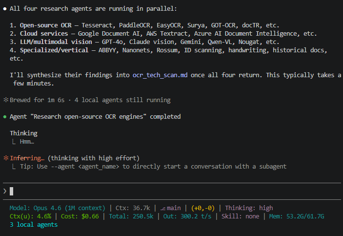

# Skills & Plugins Deep Dive

> The sections above cover what skills and plugins *are*. The deep dive below covers *why specific ones matter* — walking through notable tools in the ecosystem, how they prevent vibe coding, and when to reach for which. This is a living list that grows as new tools emerge.

---

## The Core Problem: Why "Just Prompting" Fails at Scale

When you use an agentic coding tool raw — just typing natural language and letting it go — you get what the community calls **vibe coding**: output that *looks* right on first glance but breaks down under scrutiny. The AI doesn't plan. It doesn't verify. It doesn't remember what it decided 50 messages ago. As the context window fills up, quality degrades — a phenomenon called **context rot**.

Skills and plugins solve this by injecting **structure, methodology, and constraints** into the agent's workflow. Instead of hoping the AI makes good decisions, you give it a system that *forces* good decisions.

Think of it this way: a talented junior developer can write code. But put that same developer inside a team with code reviews, TDD, sprint planning, and architectural guidelines — and the output quality is incomparable. Skills are the engineering culture you install into your AI agent.

---

## What Are Skills vs Plugins?

**Skills** are folders containing a `SKILL.md` file — instructions and methodology that Claude loads on demand via progressive disclosure. Only the metadata (~100 tokens) sits in context at all times; the full instructions load only when triggered.

**Plugins** are packaged collections of skills, commands, agents, and hooks that install into Claude Code as a unit. They're the distribution mechanism for more complex workflows.

Both serve the same purpose: **teaching the agent how to work, not just what to build.**

```text
skill-name/
├── SKILL.md              # Core instructions (required)
└── Bundled Resources/    # (optional)
    ├── scripts/          # Executable code for deterministic tasks
    ├── references/       # Docs loaded into context as needed
    └── assets/           # Templates, icons, fonts
```

---

## 1. BMAD — Breakthrough Method for Agile AI-Driven Development

**What it is:** A full agile development framework with 12+ specialized AI agents, 50+ guided workflows, and scale-adaptive intelligence that adjusts from bug fixes to enterprise systems.

**GitHub:** [bmad-code-org/BMAD-METHOD](https://github.com/bmad-code-org/BMAD-METHOD) — 35k+ stars

**Docs:** [docs.bmad-method.org](https://docs.bmad-method.org/)

### The Idea in One Sentence

Instead of one AI doing everything, BMAD simulates a full agile team — PM, Architect, Developer, QA, Scrum Master — where each agent has a defined role, constraints, and deliverable format.

### Install

BMAD is a **per-project** installation — run it inside each project repo. It writes config files, agent definitions, and workflow stubs into the project directory so the AI tool picks them up when you open that folder.

```bash
# Navigate to your project first
cd your-project

# Requires Node.js v20+
npx bmad-method install
```

The interactive installer walks you through several steps:

**Step 1 — Installation location:** Choose current directory (recommended — installs into `_bmad/` in your project root).

**Step 2 — Select your AI tool(s):** Pick the tool you're using — Claude Code, Cursor, Windsurf, Copilot, etc. The installer creates the right integration files (slash commands, skill stubs) in the format your tool expects (e.g., `.claude/skills/` for Claude Code, `.cursor/skills/` for Cursor).

**Step 3 — Select modules:** This is where you choose what capabilities to install. Most users just need the core module, but you can add domain-specific ones:

| Module | What It Adds | When to Use It |
| --- | --- | --- |
| **BMad Method (BMM)** | Core framework — 34+ workflows, 12+ agents, the full planning-to-implementation pipeline | **Always install this.** It's the foundation everything else builds on. |
| **BMad Builder (BMB)** | Tools to create your own custom BMAD agents, workflows, and domain-specific modules | When you want to extend BMAD with custom agents tailored to your team or domain |
| **Test Architect (TEA)** | Risk-based test strategy, quality gates, release gates, 34 testing patterns | When your project needs enterprise-grade test planning — compliance, NFR assessment, automated quality gates |
| **Game Dev Studio (BMGD)** | Game development workflows for Unity, Unreal, and Godot | Game projects specifically |
| **Creative Intelligence Suite (CIS)** | Innovation, brainstorming, design thinking, problem-solving | When you want structured creative exploration — ideation workshops, design sprints, narrative development |

> **Tip:** If you're unsure, just select **BMad Method (BMM)** and move on. You can always add more modules later by re-running `npx bmad-method install`.

**Step 4 — Express Setup vs Customize:** For modules with configurable options, you can accept defaults (Express Setup) or fine-tune settings per module.

After install, your project will look something like this:

```text
your-project/
├── _bmad/              # Runtime — agents, workflows, tasks
│   ├── core/           # Core agents and tasks
│   ├── bmm/            # BMad Method module files
│   └── _config/        # Manifests and help config
├── _bmad-output/       # Where the AI writes PRDs, architecture docs, stories
├── .claude/            # Claude Code integration (if selected)
│   └── skills/
│       ├── bmad-help/
│       └── ...
└── your existing code...
```

Verify it works by opening your AI tool in the project folder and running:

```text
/bmad-help
```

Not sure what to do first? Ask it:

```text
/bmad-help I just installed, what should I do first?
/bmad-help I have a SaaS idea, where should I start?
```

### Two Paths

**Simple Path** — bug fixes, small features, clear scope:

| Step | Command | What Happens |
| --- | --- | --- |
| 1 | `/quick-spec` | Analyzes your codebase, produces a tech-spec with stories |
| 2 | `/dev-story` | Implements each story |
| 3 | `/code-review` | QA agent validates quality |

**Full Planning Path** — products, platforms, complex features:

| Step | Command | What Happens |
| --- | --- | --- |
| 1 | `/product-brief` | Define problem, users, MVP scope |
| 2 | `/create-prd` | Full requirements with personas, metrics, risks |
| 3 | `/create-architecture` | Technical decisions and system design |
| 4 | `/create-epics-and-stories` | Break work into prioritized stories |
| 5 | `/sprint-planning` | Initialize sprint tracking |
| 6 | `/create-story` → `/dev-story` → `/code-review` | Repeat per story |

Every step tells you what's next. `/bmad-help` works at any point and adapts its guidance based on which modules you have installed.

### The Agent Team

Each agent has a defined persona, responsibilities, and constraints. The Architect agent won't write business logic; the QA agent won't modify architecture. They communicate through versioned markdown files (PRDs, story files, architecture docs), creating an auditable paper trail.

```text
 ANALYST             PROJECT MANAGER
 • Market research       • Roadmap & timeline
 • User research         • Resource planning
          ↓                     ↓
              ARCHITECT
              • System design
              • Tech stack decisions
              • Patterns & constraints
                    ↓
       ┌────────────┴────────────┐
   DEVELOPER              QA AGENT
   • Story implementation    • Code review
   • TDD (optional)         • Test coverage
   • Self-validation        • Security checks

 + UX Designer, Scrum Master, DevOps, and more...
```

### Party Mode

Unique to BMAD: bring multiple agent personas into a single session to collaborate. Need the Architect and QA agent to debate your auth approach? Party Mode lets them argue it out — multiple perspectives, one conversation.

### Scale-Domain-Adaptive Intelligence

BMAD adjusts planning depth based on what you're building. A SaaS dating app gets different treatment than a diagnostic medical system. You don't configure this — the system detects complexity and adapts.

### Token Optimization via Document Sharding

Instead of loading your entire PRD into context for every task, BMAD v6 shards documentation — each story file contains only the relevant specs, acceptance criteria, and architecture snippets. This reportedly achieves 74–90% token savings, which directly means better output quality because the signal-to-noise ratio stays high.

### When to Use BMAD

Best for teams that want enterprise-grade governance, audit trails, and multi-agent collaboration. If you need a PRD → Architecture → Epics → Stories pipeline with QA gates, this is the tool.

For a typo fix or quick feature, the Simple Path (`/quick-spec` → `/dev-story` → `/code-review`) keeps it lightweight.

---

## 2. GSD — Get Shit Done

**What it is:** A spec-driven development system that solves context rot through context engineering, subagent orchestration, and a structured workflow. Lightweight by design — the complexity is in the system, not in your workflow.

**GitHub:** [gsd-build/get-shit-done](https://github.com/gsd-build/get-shit-done) — 35k+ stars

**Created by:** TÂCHES (Lex Christopherson)

### The Idea in One Sentence

Break your project into small phases, plan each one, then execute each plan in a fresh 200K-token subagent so context rot never degrades quality.

### Install

```bash
# Interactive — choose runtime and location
npx get-shit-done-cc@latest

# Non-interactive for Claude Code
npx get-shit-done-cc --claude --global   # All projects
npx get-shit-done-cc --claude --local    # Current project only

# Verify — inside Claude Code:
/gsd:help
```

### The Workflow

```text
/gsd:new-project             ← Questions → Research → Requirements → Roadmap
       ↓
/gsd:discuss-phase 1         ← Shape YOUR implementation preferences
       ↓
/gsd:plan-phase 1            ← Research + atomic task plans
       ↓
/gsd:execute-phase 1         ← Build in fresh subagents (wave execution)
       ↓
/gsd:verify-work 1           ← Automated + human verification
       ↓
/gsd:complete-milestone      ← Archive + tag release
```

### Key Commands

| Command | What It Does | When to Use |
| --- | --- | --- |
| `/gsd:new-project` | Full project init — questions, research, requirements, roadmap | Starting a new project or feature |
| `/gsd:map-codebase` | Spawns parallel agents to analyze your existing stack | Before `/gsd:new-project` on existing code |
| `/gsd:discuss-phase N` | Captures your preferences for gray areas | Before planning — visual choices, API design, etc. |
| `/gsd:plan-phase N` | Research + atomic task plans with XML structure | After discussing — creates executable plans |
| `/gsd:execute-phase N` | Runs plans in parallel waves with fresh context per plan | The actual building step |
| `/gsd:verify-work N` | Automated checks + UAT | After execution — catches bugs |
| `/gsd:quick` | Lightweight mode for small tasks | Typo fixes, minor changes — skip the full workflow |

### What Makes `/gsd:discuss-phase` Special

This is the step most people skip — and it's the one that makes GSD's output feel like *yours* instead of generic AI output.

The system analyzes the phase and identifies **gray areas** — decisions that aren't in your requirements but matter for implementation:

- **Visual features** → Layout density, interactions, empty states, responsive behavior
- **APIs/CLIs** → Response format, flags, error handling, verbosity levels
- **Content systems** → Structure, tone, depth, flow
- **Data handling** → Grouping criteria, naming, duplicates, edge cases

Your answers get saved to `CONTEXT.md`, which the researcher and planner read. Deeper input here = output that matches your vision. Skip it = reasonable defaults, but not *your* defaults.

### Wave Execution

Plans are grouped into dependency-based waves. Within each wave, plans run in parallel subagents. Waves run sequentially.

```text
 WAVE 1 (parallel)           WAVE 2 (parallel)         WAVE 3
 ┌──────────┐ ┌──────────┐   ┌──────────┐ ┌──────────┐  ┌──────────┐
 │ Plan 01  │ │ Plan 02  │ → │ Plan 03  │ │ Plan 04  │→ │ Plan 05  │
 │ (schema) │ │ (config) │   │ (API)    │ │ (auth)   │  │ (UI)     │
 └──────────┘ └──────────┘   └──────────┘ └──────────┘  └──────────┘
   fresh 200K   fresh 200K     fresh 200K   fresh 200K    fresh 200K
```

Each subagent starts clean — no prior conversation, no context rot. Just the plan, the relevant code, and the full token budget.

### When to Use GSD

Best for solo developers and small teams who want spec-driven quality without enterprise ceremony. If you want the system to handle the complexity while you focus on describing what you want, GSD is the pick.

For tiny changes, use `/gsd:quick` or just prompt Claude directly — the full workflow spawns multiple agents, which is overkill for a typo fix.

---

## 3. Superpowers

**What it is:** A composable skills framework that activates *automatically* — no commands needed. You just work, and the right engineering discipline kicks in.

**GitHub:** [obra/superpowers](https://github.com/obra/superpowers) — by Jesse Vincent (Prime Radiant)

### Install

```text
/plugin marketplace add obra/superpowers-marketplace
/plugin install superpowers@superpowers-marketplace
```

Quit and restart Claude Code. You'll see a session-start hook that bootstraps the skills.

### How It Works

Where GSD and BMAD give you explicit commands to drive a workflow, Superpowers injects itself at session start and activates skills automatically based on what you're doing. You don't invoke `test-driven-development` — it fires when you're implementing features. `systematic-debugging` kicks in when you're debugging.

The core pipeline it enforces: **brainstorm → plan → implement**, with engineering disciplines layered on top at each stage.

### Key Skills (20+)

| Skill | Fires When | What It Does |
| --- | --- | --- |
| `brainstorming` | Before writing code | Refines ideas, explores alternatives, presents design in sections |
| `writing-plans` | After design approval | Creates 2–5 minute tasks with exact file paths and verification steps |
| `subagent-driven-development` | With an approved plan | Fresh subagent per task, two-stage code review |
| `test-driven-development` | During implementation | Enforces RED → GREEN → REFACTOR |
| `systematic-debugging` | When debugging | Hypothesis → evidence → fix (not random code changes) |
| `verification-before-completion` | Before claiming done | Actually runs and checks the output |
| `using-git-worktrees` | After design approval | Isolates work on a new branch with clean baseline |

### Composability

Skills stack. During a feature build, you might have `test-driven-development` + `subagent-driven-development` + `verification-before-completion` all active simultaneously. Each adds a layer of discipline without conflicting.

You can also create your own skills following the `writing-skills` skill guide and contribute them back.

### When to Use Superpowers

Best when you want engineering rigor on every task without remembering commands. Superpowers pairs well with GSD or BMAD — they handle orchestration (what to build in what order), Superpowers handles execution quality (how each piece is built properly).

---

## 4. Creating Your Own Skills — Best Practices

Skills aren't just for installing other people's work. The most impactful skills are often the ones you build for your team's specific workflows, conventions, and patterns.

Think about the prompts your team copies and pastes repeatedly: code review checklists, deployment procedures, PR templates, data migration patterns, incident response playbooks. Every one of those is a skill waiting to be created.

### The Anatomy of a Skill

```text
skill-name/
├── SKILL.md              # Core instructions (required)
└── Bundled Resources/    # (optional)
    ├── scripts/          # Executable code for deterministic tasks
    ├── references/       # Docs loaded into context as needed
    └── assets/           # Templates, icons, fonts
```

Every skill needs a `SKILL.md` with two parts: YAML frontmatter (tells the agent *when* to use it) and markdown content (tells the agent *how*).

### Using the Skill Creator

Anthropic provides a built-in **Skill Creator** — a meta-skill that helps you create, evaluate, improve, and benchmark other skills.

Invoke it with `/skill-creator` and choose a mode:

| Mode | What It Does |
| --- | --- |
| **Create** | Build a new skill from a description — asks targeted questions, generates SKILL.md + test cases |
| **Eval** | Run test cases against an existing skill, grade results |
| **Improve** | Analyze eval failures and apply fixes |
| **Benchmark** | Measure performance across multiple runs with variance analysis |

### The #1 Mistake: Bad Descriptions

Claude decides whether to load a skill based on its `description` field in the frontmatter. This is a **trigger**, not a summary. Anthropic's own docs warn that Claude tends to "undertrigger" — it won't use skills when it should unless the description is explicit.

**Bad:**

```yaml
description: How to build a dashboard
```

**Good:**

```yaml
description: >
  How to build a simple fast dashboard to display internal data.
  Use this skill whenever the user mentions dashboards, data
  visualization, internal metrics, or wants to display any kind
  of data, even if they don't explicitly ask for a 'dashboard.'
```

### Key Best Practices

- **Keep SKILL.md under 500 lines** — move reference material to `references/` subdirectories
- **Skills are folders, not files** — use `references/`, `scripts/`, `examples/` for progressive disclosure
- **Build a Gotchas section** — highest-signal content; add the agent's failure points over time
- **Don't state the obvious** — focus on what pushes the agent *out of its default behavior*
- **Test incrementally** — test after each significant change, not all at once
- **Skills compose** — the agent can use multiple skills together automatically

### Where to Put Your Skills

| Audience | Location |
| --- | --- |
| Just you | `~/.claude/skills/` directory |
| Your project/team | `.claude/skills/` in the repo (everyone who clones gets it) |
| Your org | Team/Enterprise provisioning via Settings |
| Everyone | ZIP upload to Claude.ai, or publish to a plugin marketplace |

### Example: Creating a Team-Specific Skill

```text
You: /skill-creator

    "Create a skill for our team's PR review process. We require:
     - Security review for any auth/payment changes
     - Performance review for database queries
     - All PRs must have tests
     - Commit messages follow Conventional Commits"

Skill Creator: [asks 4-5 clarifying questions]
             → Generates SKILL.md with review checklist
             → Creates test cases (PR with auth changes, PR with no tests, etc.)
             → Runs evals
             → Presents results for your review
```

---

## 5. Codex for Claude Code

**What it is:** An official OpenAI plugin that lets you invoke Codex CLI from inside Claude Code — get a second opinion from a different frontier model without leaving your workflow.

**GitHub:** [openai/codex-plugin-cc](https://github.com/openai/codex-plugin-cc) — 3.4k stars

**Requires:** ChatGPT subscription (including Free) or OpenAI API key, plus Node.js 18.18+.

### Install

```bash
# Add the marketplace
/plugin marketplace add openai/codex-plugin-cc

# Install the plugin
/plugin install codex@openai-codex

# Reload and run setup
/reload-plugins
/codex:setup
```

`/codex:setup` checks if Codex CLI is installed and authenticated. If not, it can install it for you.

### Key Commands

| Command | What It Does |
| --- | --- |
| `/codex:review` | Read-only code review of uncommitted changes or a branch diff. Same quality as running `/review` inside Codex directly. |
| `/codex:adversarial-review` | Steerable review that challenges your implementation — questions design choices, tradeoffs, hidden assumptions. Add focus text like "look for race conditions." |
| `/codex:rescue` | Hands a task to Codex as a background job — investigate a bug, try a fix, take a pass with a different model. |
| `/codex:status` | Check progress on background Codex jobs. |
| `/codex:result` | Show the final output of a completed Codex job. |
| `/codex:cancel` | Cancel an active background job. |

### Why Use It

The value is simple: **a second pair of eyes from a different model.** Claude and Codex have different strengths and blind spots. Running `/codex:adversarial-review` after Claude finishes a feature is like having a second senior engineer challenge your assumptions before you ship.

The `/codex:rescue` command is also handy when Claude is stuck on something — delegate it to Codex as a background job and keep working.

### Typical Flows

**Review before shipping:**

```text
/codex:review --base main --background
/codex:status
/codex:result
```

**Get a second opinion on design:**

```text
/codex:adversarial-review challenge whether this was the right caching strategy
```

**Delegate a stuck problem:**

```text
/codex:rescue investigate why the integration tests are flaky
```

---

## 6. Document Skills — docx, pdf, pptx, xlsx

**What it is:** Anthropic's official document processing plugin — a bundle of four skills (`docx`, `pdf`, `pptx`, `xlsx`) that give Claude the ability to create, read, and edit Word, PDF, PowerPoint, and Excel files as first-class deliverables. These are the same skills that power [Claude's "create files" feature](https://www.anthropic.com/news/create-files) in production.

**GitHub:** [anthropics/skills](https://github.com/anthropics/skills) — 117k+ stars

### The Idea in One Sentence

Stop asking Claude to "generate a report" as a wall of text — install the right skill and you get back a properly formatted `.docx`, `.pdf`, `.pptx`, or `.xlsx` that opens cleanly in the native application, not a markdown file with a misleading extension.

### Install

For Claude Code, install them as a plugin:

**Option A — Slash commands (inside the Claude Code CLI)**

```bash
# Add the Anthropic marketplace
/plugin marketplace add anthropics/skills

# Install the document-skills bundle
/plugin install document-skills@anthropic-agent-skills
```

**Option B — Terminal CLI** 

```bash
# Add the Anthropic marketplace
claude plugin marketplace add anthropics/skills

# Install the document-skills bundle
claude plugin install document-skills@anthropic-agent-skills
```

Once installed, the skills activate automatically when you mention the relevant task — no slash command needed:

- "Convert this markdown into a Word doc"
- "Extract the tables from this PDF"
- "Turn these notes into a slide deck"

### The Four Skills

| Skill | What It Does | Triggers On |
| --- | --- | --- |
| **docx** | Create, read, edit `.docx` files. Tables of contents, headings, page numbers, letterheads, tracked changes, comments, find-and-replace, image insertion. | "Word doc", `.docx`, formal reports, memos, letters, templates |
| **pdf** | Read/extract text and tables, create new PDFs, merge/split, rotate pages, watermarks, fill forms, encrypt/decrypt, extract images, OCR. | Anything involving `.pdf` — reading or producing |
| **pptx** | Create slide decks, read/extract text from slides, edit presentations, work with templates, layouts, speaker notes, comments. | "deck", "slides", "presentation", `.pptx` |
| **xlsx** | Open/read/edit `.xlsx`, `.xlsm`, `.csv`, `.tsv`. Add columns, compute formulas, formatting, charting, clean messy tabular data. | Spreadsheets, any tabular file as the primary deliverable |

### Why It Matters

Without these skills, asking Claude to "make a PowerPoint" typically produces markdown pretending to be slides or a long text description of what the slides *would* contain. With the `pptx` skill, you get an actual `.pptx` file with real slide layouts, proper hierarchy, and formatting that opens in PowerPoint, Keynote, or Google Slides.

The same principle holds across all four: the skill bundles the Python libraries, formatting conventions, and do/don't rules needed to produce a file that is **structurally correct**, not just textually plausible.

### When to Use It

Always — if the deliverable is a document *file*. Skip only when the user explicitly wants content inline in chat (a quick table they'll read on screen, a brief summary, prose they'll copy-paste elsewhere).

---

## ✍️ Workshop Exercise: Research and Report Generation Workflow

**Time:** ~20 minutes

This hands-on chains two capabilities end-to-end — the kind of pipeline you'd actually run in production:

1. **Parallel research via sub-agents** — spawn multiple research agents to cover different angles of a topic simultaneously, then synthesize their findings into a single markdown report.
2. **Multi-format publication via document-skills** — take that generated markdown and produce a Word doc, PDF, and slide deck from the same source.
The example topic is a **technology scan of current OCR tools**, but the workflow generalizes to any research-heavy deliverable: competitive analyses, vendor evaluations, market briefings, literature reviews.

### Setup (3 min)

You need:

- **Claude Code** with the `document-skills` plugin installed (see install block above)
- **Web access:** web search must be enabled so the research sub-agents can actually look things up
- A **working directory** for your outputs (anywhere you can write files), preferably in VSCode.
Pick your topic. Stick with OCR if you want to follow along exactly, or swap in something relevant to your work (e.g., "vector databases in 2026", "open-source LLM serving frameworks", "cloud-native observability tools"). The prompts below will work for any tech-scan topic.

### Phase 1 — Research with Sub-Agents (12 min)

The goal here is **breadth through parallelism**. Instead of asking Claude to research OCR in one long sequential pass (where context fills up and later searches degrade), we split the topic into independent slices that run in parallel sub-agents, each with its own fresh context window.

Paste this into Claude (adjust the categories if you picked a different topic):

```text
I want a technology scan of the current state of OCR (Optical
Character Recognition) tools as of 2026.
 
Run the work in three steps.
 
Step 1 — Decompose the landscape.
Before searching anything, propose four meaningful slices of
this topic that four parallel research agents could cover
independently with minimal overlap. Slices could be by category
(e.g., open-source vs. managed), by technical approach, by use
case, by maturity, or any cut that divides the topic cleanly.
Show me your four proposed slices in one short paragraph each,
then proceed to Step 2.
 
Step 2 — Research in parallel.
Spawn 4 sub-agents, one per slice. Each should run independent
web searches and return:
  - The leading tools, products, or approaches in that slice
  - For each: what it does well, known limitations, cost or
    licensing model, maturity, any notable developments in the
    last 6–12 months
 
Step 3 — Synthesize.
Once all sub-agents return, produce a single markdown report:
  - Executive summary (3–4 sentences)
  - Landscape overview (one paragraph per slice)
  - Comparison matrix (rows = leading tools; columns = the
    dimensions you judged most important for this topic —
    you pick which dimensions matter)
  - Deep dive per slice, with short sub-sections per tool
  - Recommendations by use case
  - Sources and references
 
Save as ocr_tech_scan.md in the current directory.
```

**What to watch for while this runs:**

- Claude should explicitly announce each sub-agent spawn
- Sub-agents run in **parallel**, not sequentially. Total time taken should be closer to the slowest agent than the sum of all four
- Each sub-agent returns a structured chunk, and the final synthesis pass stitches them together
When it finishes, open `ocr_tech_scan.md` and skim it. You should have a genuinely useful 4–8 page tech scan, far richer than what a single search-and-summarize prompt would produce.

What it should look like:



### Phase 2 — Convert to Polished Deliverables (8 min)

Now the document-skills take over. Same source markdown, three different output formats, each one leaning into what that format does well.

**Target 1 — Word document (`docx` skill)**

```text
Using the docx skill, convert ocr_tech_scan.md into a
professional Word document. Add a title page with the report
title and today's date, a table of contents, page numbers in
the footer, and preserve all comparison tables. Save as
ocr_tech_scan.docx.
```

**Target 2 — PDF (`pdf` skill)**

```text
Using the pdf skill, produce ocr_tech_scan.pdf from
ocr_tech_scan.md. Style it for executive distribution: running
header with the report title, page numbers in the footer, and
make sure the comparison matrix renders cleanly across pages.
```

**Target 3 — PowerPoint briefing (`pptx` skill)**

```text
Using the pptx skill, create ocr_tech_scan.pptx — a 10-slide
executive briefing based on ocr_tech_scan.md.

Slide plan:
  1. Title slide
  2. Executive summary
  3. Landscape overview (the four categories)
  4-7. One slide per category with top tools
  8. Comparison matrix (as a slide-native table)
  9. Recommendations by use case
  10. Sources

Keep bullets crisp — max 5 per slide, no wall-of-text.
```

**Bonus — Spreadsheet (`xlsx` skill)**

```text
Using the xlsx skill, extract the comparison matrix from
ocr_tech_scan.md into ocr_tech_scan.xlsx. Add a second tab
that groups tools by category with their pricing tier and
best-fit use case.
```

### Reflect (2 min)

Open all the generated files and compare them against the original `ocr_tech_scan.md`:

- **Sub-agents vs. solo search** — was the research meaningfully wider than what you'd get from a single search-and-summarize prompt? Did it catch tools you hadn't heard of?
- **Format-specific value-add** — the docx gets a TOC and page numbers. The PDF gets running headers. The pptx distills dense paragraphs into slide bullets. The skill is doing work beyond "export" — it's translating intent into what each format does well.
- **Pipeline compression** — end-to-end, how long would this have taken you manually? (Research the four categories → write the report → format for Word → lay out slides → build the spreadsheet.) Probably a full day. The workflow above compresses it to ~25 minutes and the outputs are starting points, not finished products — you still edit and own the final version.

> **The takeaway:** Sub-agents give you **breadth without context rot**; document-skills give you **polish without hand-formatting**. Chained together, they turn "I need a tech scan with exec-ready deliverables by end of day" from a day of work into a focused editing pass over Claude's draft. The model didn't get smarter — the workflow got better.

---

## ✍️ Workshop Exercise: GSD Hands-On

**Time:** ~20 minutes

We've been building a CRUD app throughout this workshop. Now let's see what happens when we run a structured methodology on top of it, and compare it to going in raw.

### Setup (5 min)

Install GSD into a fresh project directory:

```bash
mkdir gsd-workshop && cd gsd-workshop
git init
npx get-shit-done-cc --claude
```

Open Claude Code in that directory.

### Run the Workflow (10 min)

1. **Start a new project** — type `/gsd:new-project` and describe a simple idea (e.g., "A Simple CRUD App").
    1. You should use the same project idea as before to see the difference. 
2. **Answer the system's questions** — notice how it asks until it understands your idea completely before doing anything else.
3. **Review the output** — the system produces `PROJECT.md`, `REQUIREMENTS.md`, `ROADMAP.md`, and `STATE.md`. Skim through them.
4. **Discuss a phase** — run `/gsd:discuss-phase 1` and answer the gray area questions. Notice how it asks about decisions you hadn't thought of (output format, error handling, edge cases).
5. **Check CONTEXT.md** — open the generated context file. Your preferences are now captured and will feed into the planner.

### Reflect (5 min)

Open the files GSD generated — `REQUIREMENTS.md`, `CONTEXT.md`, and the task plans. Now compare:

- "Vibe Coding": started coding immediately. What assumptions did it make that you didn't agree with?
- "Spec-Driver": asked you 10+ questions before writing a single line. How many of those decisions would you have caught in code review instead?
- Look at the task plans from `/gsd:plan-phase`. Each one runs in a fresh 200K-token subagent — no context rot. Compare that to a single long conversation where quality degrades as context fills up.

> **The takeaway:** The 15 minutes you spent specifying and discussing didn't slow you down, instead it front-loaded decisions that would otherwise surface as bugs, rework, and "that's not what I wanted." The difference between vibe coding and professional agentic development isn't the model. It's the methodology.

---

[← Back to main page](.)
